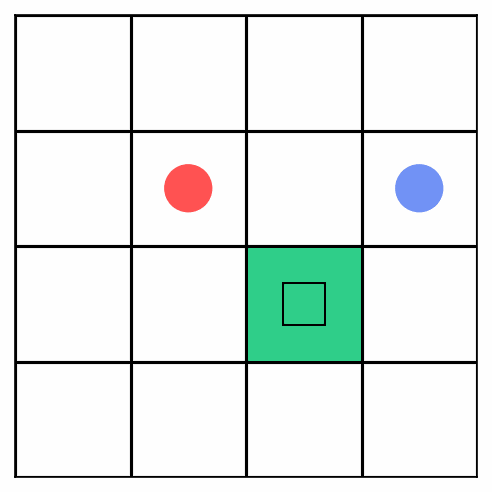

## Overview
This project implements a Deep Q-Network (DQN) agent that learns to play ColorTiles(https://github.com/daikImai/ColorTiles) through reinforcement learning.

## Features and Key Algorighms
- **Deep Q-Network (DQN)**
  - Built using PyTorch
  - Learns a value function Q(s,a) that maps states to expected future rewards
- **ε-Greedy Exploration**
  - Starts with high exploration (ε = 1.0)
  - Gradually decreases ε over episodes
- **Prioritized Experience Replay (PER)**
  - Samples transitions based on TD error, improving data efficiency by focusing on informative experiences
  - Adjustable α (priority exponent) and β (importance sampling correction)
- **Success Buffer**
  - Stores transitions from successful episodes and reuses them to reinforce positive learning signals
 
## Demo

## Future Improvements

- **Double DQN**
  - Reduces overestimation bias by separating action selection and evaluation
- **Dueling Network Architecture**
  - Learns state value and action advantage separately for more stable learning
- **Training Visualization**
  - Use TensorBoard to monitor training progress (loss, reward trends, epsilon decay)
